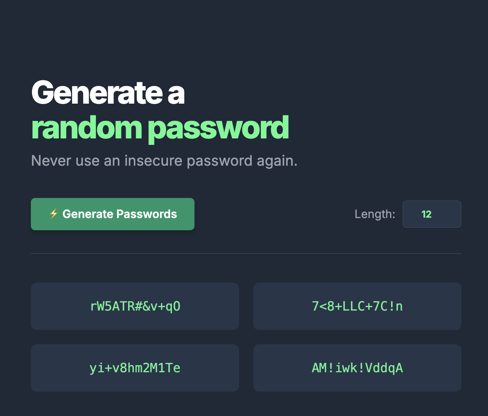
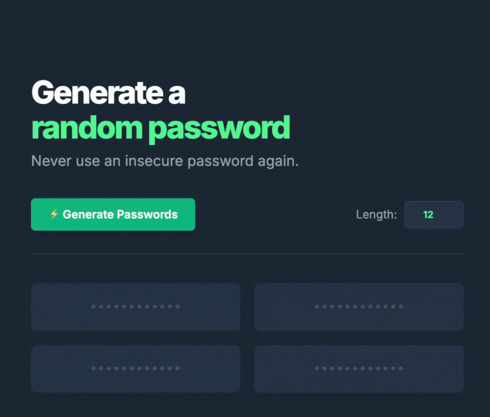

# 🔐 Secure Random Password Generator


A sleek, dark-themed **Random Password Generator** built with **HTML5**, **CSS3**, and **Vanilla JavaScript**. Never use an insecure password again—instantly generate four highly secure, randomized passwords containing uppercase, lowercase, numbers, and symbols, and copy them to your clipboard with a single click.

---
## 📸 Preview
 

## 🎥 Demo
 


---
## 🚀 Live Demo

[Open Password Generator](https://yamankadoura.github.io/Random-password-generator/)

---

## ✨ Features

- 📏 **Adjustable Length:** Choose your desired password length (between 8 and 24 characters).
- 🎲 **Robust Randomization:** Pulls from a comprehensive array of letters (upper/lowercase), numbers, and special symbols.
- 📋 **One-Click Copy:** Click on any generated password to instantly copy it to your clipboard.
- 🎨 **Modern Dark Theme:** A visually pleasing dark mode UI with neon accents and interactive hover states.
---

## 🛠 Technologies

- HTML5
- CSS3 (CSS Grid, Flexbox, Transitions)
- Vanilla JavaScript (ES6, Clipboard API)

---

## 📂 Project Structure

```text
Password-Generator/
│
├── index.html
├── index.css
├── index.js
├── README.md
│
└── images/
    ├── screenshot.png
    └── run_example.gif